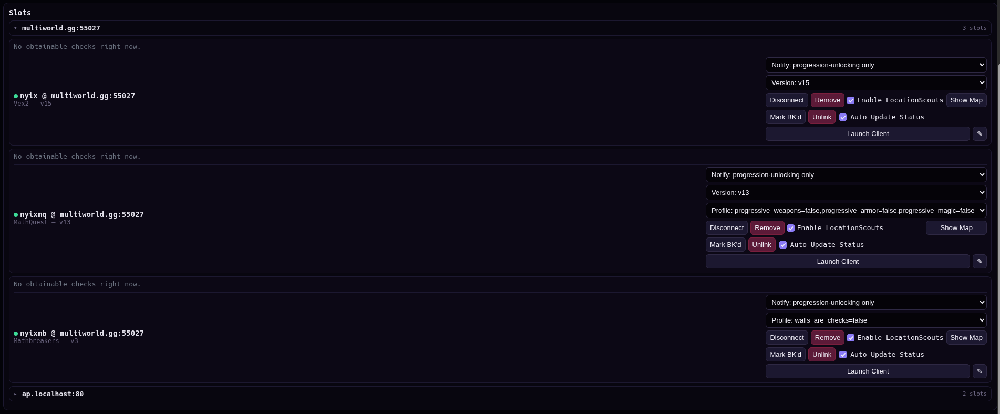
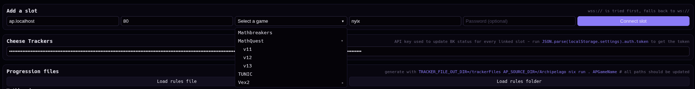
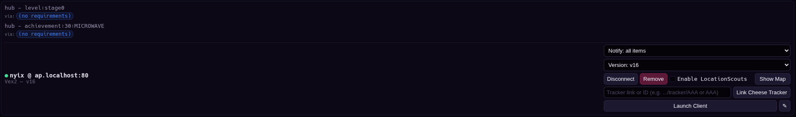
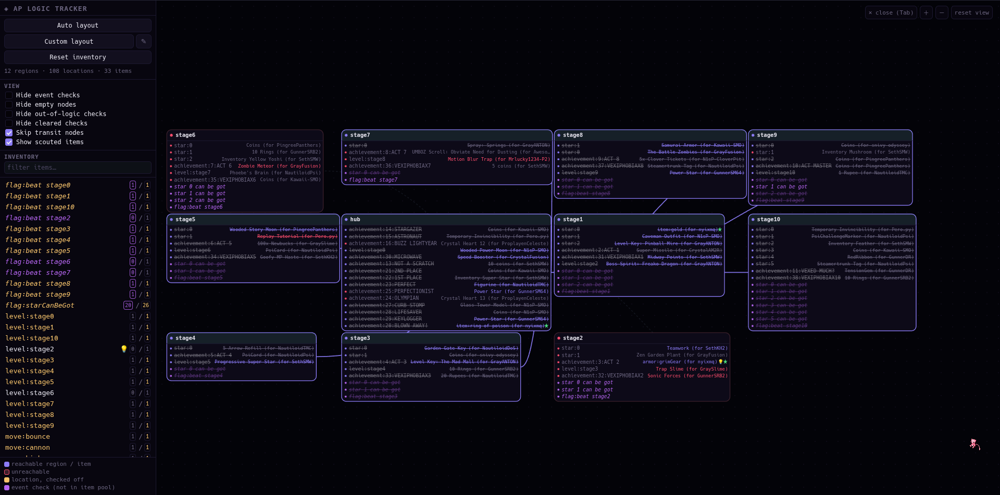
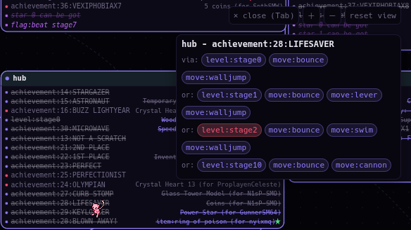
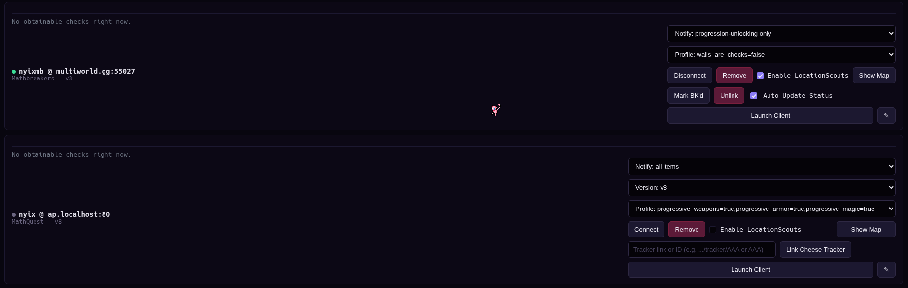
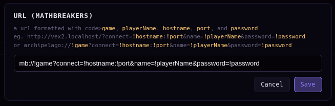
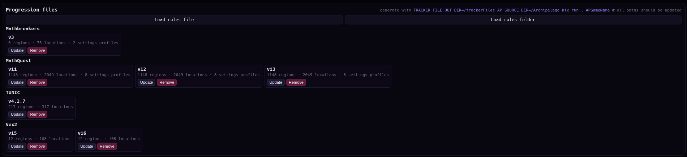

# AP Multi-Slot Tracker

A browser-based tracker for [Archipelago](https://github.com/ArchipelagoMW/Archipelago/) that connects to **multiple slots at once**, gives you desktop notifications when items unlock new checks, and renders a full logic-aware map for each connected game — all client-side, no server required.
The main goal of this project is to make tracking logic work for every game without requiring world devs having to support any trackers - everything can be done solely by the users of this tracker.



## Features

### Multi-slot connection manager

- Connect to as many Archipelago slots (rooms/players) simultaneously as you want, each tracked independently.
- Per-slot connection status (connecting / connected / error / disconnected) with automatic `wss://` → `ws://` fallback.
- Auto-reconnect on page load for any slot marked to auto-connect.
- Per-slot notification modes: **none**, **all items**, **progression-unlocking only**, or **all (with progression highlighted)**.
- Desktop notifications via the Notifications API when items come in, optionally only when they actually unlock something new.



### Logic-aware progression tracking

- Loads externally generated **rules JSON** files (region/entrance/location logic graphs — see [Generating rules files](#generating-rules-files) below) and evaluates them live against each slot's received items and checked locations.
- Per-slot log of currently **obtainable-but-unchecked** locations, each annotated with the exact item requirements (as OR-of-AND requirement chips) still needed or already satisfied.
- Supports multiple loaded versions of the same game's rules (e.g. after a re-roll) — pick which version a slot tracks from a dropdown.
- Supports rules files with **multiple bundled settings profiles** (e.g. a sweep over `walls_are_checks=True/False`) — each slot independently picks which profile it evaluates against.



### Interactive logic map

- A full pan/zoom canvas map of the loaded game's regions, entrances, and locations, opened per-slot with **Show Map** (or the `Tab` key).
- Nodes are colored by reachability; locations show checked/unchecked, event, hinted, and scouted-item state.
- Drag nodes to reposition them (saved per game), or use:
  - **Auto layout** — automatic BFS-layer based layout.
  - **Custom layout** — write your own `sort(name) -> {x, y}` grid-placement function per game, saved and editable in-app.
- View filters: hide event checks, hide empty nodes, hide out-of-logic checks, hide cleared checks, skip transit (check-less) nodes, show scouted items.
- Hovering a location shows a popup with its requirement groups, color-coded by what you currently own.
- Search box (`/` to focus) filters both the inventory list and the map to matching items/regions/locations.
- Right-click an inventory item to request an in-game hint for it.
- Item Indicators - need better name i think
  - a 💡 is shown on inventory items that the slot has hinted
  - a 💡 is shown on the map on locations that have a hinted item located there
  - a green ★ is shown on local items
  - a yellow ★ is shown on nonlocal items that are for another tracked slot





### Cheese Trackers integration

- Link any slot to a game on a [Cheese Trackers](https://cheesetrackers.theincrediblewheelofchee.se/) tracker (auto-matched by slot name).
- Manually toggle or **auto-sync** a slot's BK (blocked) status to match whether it currently has any obtainable checks.



### Launch URL shortcuts

- Define a per-game "Launch Client" URL template (e.g. to jump straight into a game's own web client or `archipelago://` handler) with placeholders for `!hostname`, `!port`, `!playerName`, `!password`, `!game`.
- One click from a slot card opens the game's client pre-filled with that slot's connection info.



### Offline-friendly

- Installable as a PWA with a service worker that caches the app shell and serves cached responses when the network is unavailable.

## Usage

### 1. Generate rules JSON for a game (optional, for map/progression features)

The map and progression-tracking features need a **rules JSON** file describing a game's logic graph. Generate one from an [Archipelago](https://github.com/ArchipelagoMW/Archipelago) checkout using `generate-global-tracker-data.py`:

```bash
AP_SOURCE_DIR="/path/to/Archipelago" \
TRACKER_FILE_OUT_DIR="/path/to/trackerFiles" \
python generate-global-tracker-data.py Vex2
```

- The first arguments (before any `--` flag) are one or more **world specs**: a registered game name, a path to a `.apworld` file, or a path to a world's source folder. Multiple specs generate multiple games in one invocation.
- `--options NAME v1,v2 ...` sweeps one or more option axes and bundles every combination into the output as settings profiles (saved to `<GAME>_tracker_options_meta.json` next to the output, so future runs remember them automatically).
- `--profiles '{"name": {option: value}, ...}'` (or `--profiles @file.json`) gives full manual control over named profiles instead of a cartesian sweep.
- Output is written as `<GAME>_tracker_rules_<VERSION>.json` in `TRACKER_FILE_OUT_DIR`.

### 2. Load rules JSON into the tracker

In the **Progression files** panel:

- **Load rules file** — pick one or more rules JSON files directly.
- **Load rules folder** — pick a folder; every `.json` file directly inside it is loaded and re-scanned automatically on future page loads.



### 3. Add a slot

Fill in the **Add a slot** form: server hostname, port, the game (selected from rules files you've loaded — games with multiple loaded versions expand into a submenu), your slot name, and an optional password. Submitting connects immediately and saves the slot.

### 4. Track it

- Watch the slot card's log for newly obtainable checks and desktop notifications as items arrive.
- Click **Show Map** to open the full logic map for that slot; it stays synced live as items/checks come in.
- Optionally link the slot to **Cheese Trackers** and set up a **Launch Client** URL for it.

## Architecture notes

- Pure client-side app (no backend) — slot connections are plain WebSocket clients speaking the Archipelago protocol directly from the browser.
- Persistent state (`db`) is backed by IndexedDB via `indexeddbProxy.js`; reads/writes to `window.db.*` are transparently persisted.
- The map is rendered on a single `<canvas>` rather than per-node DOM elements, so it stays fast even with very large logic graphs — only on-screen nodes/edges are drawn each frame.
- `RuleEngine.evalRule` (the logic-tree evaluator) and `MapEngine`'s reachability pass are shared between the live map UI and the headless progression tracking used for notifications/Cheese Trackers sync, so both always agree on what's currently reachable.
- Rules JSON files can bundle multiple settings profiles; any field that differs between profiles is stored as `{ "_by_profile": { profileName: value } }` and resolved down to a flat graph per slot/map view via `MapEngine.resolveProfile`.

## Requirements

- A modern browser with File System Access API support (for loading rules files/folders) and WebSocket support.
- An Archipelago server to connect to.
- Python 3.14 an Archipelago source checkout, only if generating your own rules JSON files.

## Known limitations

- Rule parsing can't work on worlds that use the old rule syntax that some games like `TUNIC` are still using - everything will return always accessible if trying.
