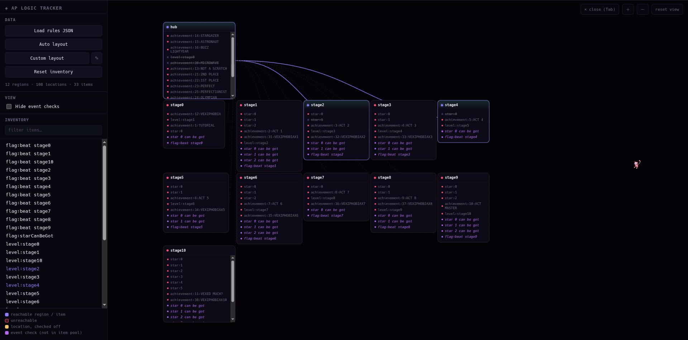

made to show logic for any game with no dev setup required, unlike other trackers like poptracker that require each world dev to include support for it

it avoids need for world devs by using the ap functions to generate a world, then grabbing all the rules and saving them all to the tracker file

this does mean that the maps won't have any official mapart so everything is just a text node that can be positioned wherever you think that location should be at

